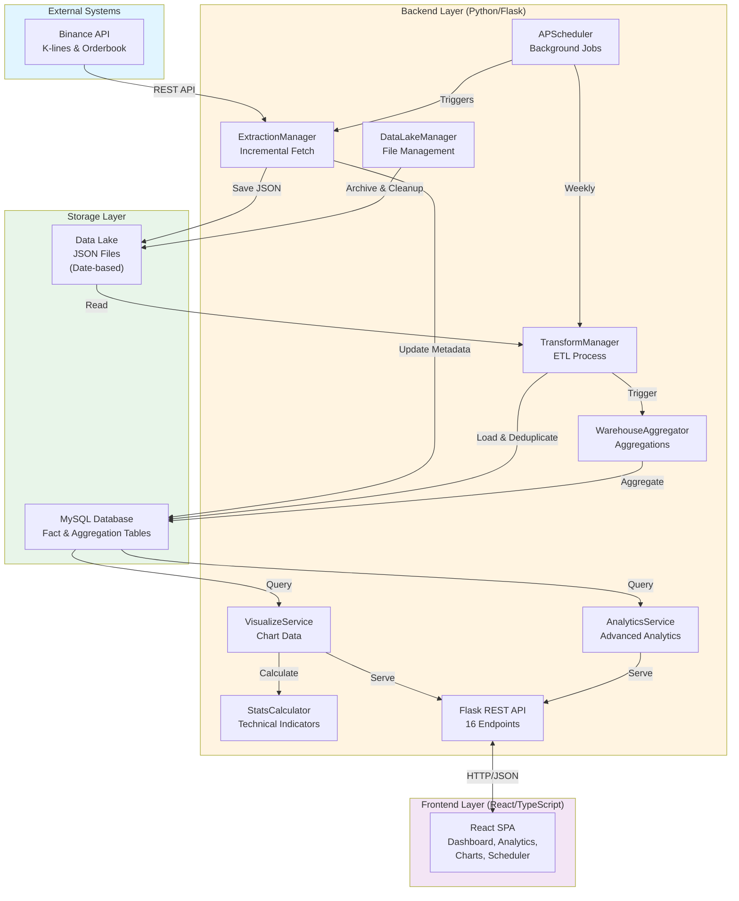
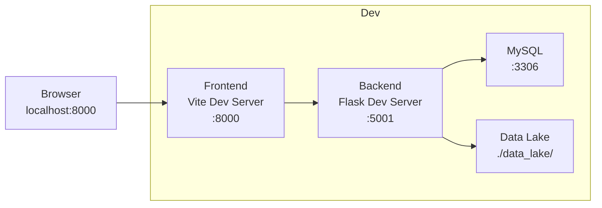
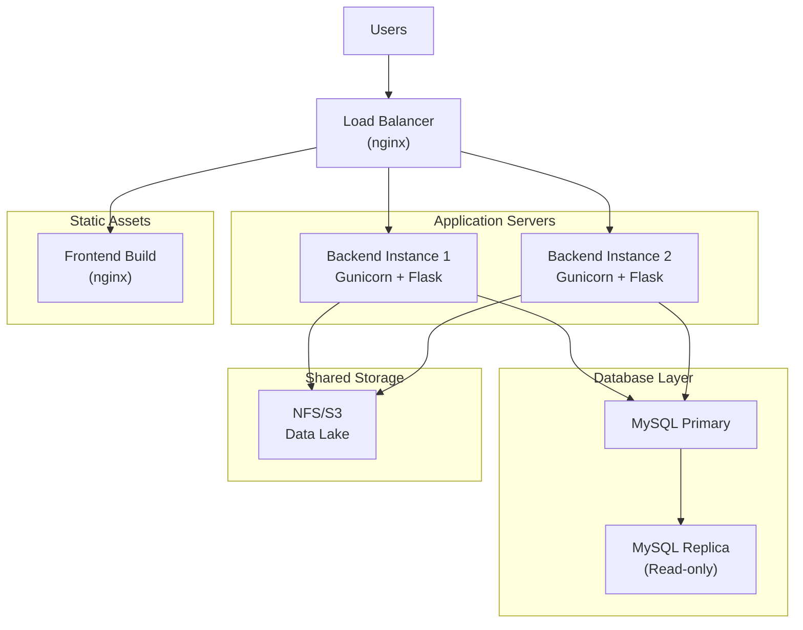

# System Architecture

This document provides a comprehensive overview of the CryptoSimpleDataPipeline system architecture, including components, design patterns, and technology stack.

## Table of Contents

1. [System Overview](#system-overview)
2. [High-Level Architecture](#high-level-architecture)
3. [Component Breakdown](#component-breakdown)
4. [Technology Stack](#technology-stack)
5. [Design Patterns](#design-patterns)
6. [System Boundaries](#system-boundaries)
7. [Deployment Architecture](#deployment-architecture)

---

## System Overview

The **CryptoSimpleDataPipeline** is a professional-grade cryptocurrency data pipeline and analytics platform that:

- **Extracts** cryptocurrency market data from Binance API (k-lines and orderbook)
- **Stores** raw data in a file-based data lake with automatic archiving
- **Transforms** and loads data into a MySQL data warehouse with deduplication
- **Aggregates** data into hourly and daily summaries for efficient querying
- **Visualizes** data through a modern React-based dashboard with real-time charts and analytics

**Key Design Philosophy**:
- **Incremental Data Extraction**: Only fetch new data to minimize API calls
- **Automatic Deduplication**: Prevent duplicate records in the database
- **Intelligent Archiving**: Automatic file management with configurable retention
- **Modular Architecture**: Decoupled components for maintainability and testability

---

## High-Level Architecture



---

## Component Breakdown

### 1. Data Extraction Layer

#### ExtractionManager
**Location**: `src/modules/extract/manager.py`

**Responsibilities**:
- Fetch k-lines (candlestick) data from Binance API
- Fetch orderbook (depth) data from Binance API
- Implement incremental extraction using metadata tracking
- Save raw JSON files to data lake
- Update extraction metadata in database

**Key Features**:
- **Smart Incremental Fetch**: Only fetches new data since last extraction
- **Metadata Tracking**: Tracks `last_open_time` and `record_count` per symbol and data type
- **Gap Calculation**: Automatically calculates how many minutes of data to fetch
- **Error Handling**: Graceful handling of API failures and timeouts

**Key Methods**:
- `run_cycle()` - Main extraction loop for all symbols
- `fetch_klines(symbol, start_time, limit)` - Fetch candlestick data
- `fetch_depth(symbol, limit)` - Fetch orderbook snapshot
- `get_last_extraction_time(symbol, data_type)` - Get metadata
- `update_extraction_metadata(symbol, data_type, last_open_time, count)` - Update metadata
- `save_to_datalake(data, symbol, data_type)` - Save JSON file

---

### 2. Data Lake Layer

#### MinioClient
**Location**: `src/modules/datalake/minio_client.py`

**Responsibilities**:
- Provide S3-compatible object storage interface
- Manage MinIO buckets (`crypto-raw`, `crypto-archive`)
- Upload/download data objects
- Move objects between buckets (archiving)
- List and delete objects

**Key Features**:
- **S3-Compatible**: Uses MinIO Python SDK for S3-compatible operations
- **Bucket Management**: Auto-creates buckets if they don't exist
- **Direct Upload**: Upload data directly to MinIO without temporary files
- **Object Operations**: Full CRUD operations on MinIO objects

**Key Methods**:
- `upload_data(data, object_name, bucket)` - Upload data directly to MinIO
- `upload_file(file_path, object_name, bucket)` - Upload from local file
- `get_object_content(object_name, bucket)` - Get object as string
- `list_objects(prefix, bucket)` - List objects with prefix filter
- `move_object(src_object, dst_object, src_bucket, dst_bucket)` - Move between buckets
- `delete_object(object_name, bucket)` - Delete an object
- `object_exists(object_name, bucket)` - Check if object exists

**MinIO Configuration** (`src/config.py`):
```python
MINIO_ENDPOINT = 'localhost:9000'
MINIO_ACCESS_KEY = 'minioadmin'
MINIO_SECRET_KEY = 'minioadmin123'
MINIO_BUCKET_RAW = 'crypto-raw'      # Active data
MINIO_BUCKET_ARCHIVE = 'crypto-archive'  # Archived data
MINIO_SECURE = False  # Use HTTPS (production: True)
```

#### DataLakeManager
**Location**: `src/modules/datalake/manager.py`

**Responsibilities**:
- Track processed files in database
- Archive objects older than 7 days (move from `crypto-raw` to `crypto-archive` bucket)
- Clean up archived objects older than 30 days (delete from `crypto-archive`)
- Provide statistics about data lake storage

**Storage Organization**:
```
MinIO Buckets:
├── crypto-raw/           # Active data (0-7 days)
│   ├── 2026-01-09/
│   │   ├── BTCUSDT_klines_1736428800000.json
│   │   ├── BTCUSDT_depth_1736428800123.json
│   │   └── ...
│   ├── 2026-01-10/
│   └── ...
└── crypto-archive/       # Archived data (7-30 days)
    ├── 2026-01-01/
    └── ...

Local Files (DEPRECATED):
data_lake/
├── raw/                  # Legacy local storage
└── archive/              # Legacy archived files
```

**Key Methods**:
- `mark_file_processed(file_path, symbol, data_type, record_count)` - Track in database
- `is_file_processed(file_path)` - Check if already processed
- `archive_old_files(days_old=7)` - Move to archive bucket
- `cleanup_old_archives(days_old=30)` - Delete old archives
- `get_statistics()` - Get file counts and storage type

---

### 3. Data Transformation Layer

#### TransformManager
**Location**: `src/modules/transform/manager.py`

**Responsibilities**:
- Process JSON files from data lake
- Load data into MySQL fact tables
- Implement deduplication using `ON DUPLICATE KEY UPDATE`
- Detect and fill gaps in k-lines data
- Trigger aggregation after successful loads
- Track processed files to avoid reprocessing

**Key Features**:
- **Automatic Deduplication**: Uses composite primary keys to prevent duplicates
- **Gap Detection**: Identifies missing minute-level data
- **Gap Filling**: Fetches missing data from Binance API
- **Processed File Tracking**: Records processed files in `processed_files` table

**Key Methods**:
- `process_recent_files()` - Process today's files
- `process_file(filepath, force_process)` - Process single file
- `_process_klines(filepath, cursor)` - Load k-lines data
- `_process_depth(filepath, cursor)` - Load orderbook data
- `_detect_and_fill_gaps()` - Find and fill data gaps
- `run_maintenance()` - Execute maintenance tasks

---

### 4. Data Warehouse Layer

#### WarehouseAggregator
**Location**: `src/modules/warehouse/aggregator.py`

**Responsibilities**:
- Create hourly aggregations from minute-level data
- Create daily aggregations from hourly data
- Clean up old raw data (90-day retention)
- Provide warehouse statistics

**Aggregation Logic**:
- **Hourly**: Groups minute data by hour, calculates OHLCV
- **Daily**: Groups hourly data by day, calculates OHLCV
- **OHLC Calculation**:
  - **Open**: First price in period (using `GROUP_CONCAT` with `ORDER BY`)
  - **High**: Maximum price in period
  - **Low**: Minimum price in period
  - **Close**: Last price in period (using `GROUP_CONCAT` with `ORDER BY DESC`)
  - **Volume**: Sum of volume in period

**Key Methods**:
- `aggregate_hourly(symbol)` - Create hourly summaries
- `aggregate_daily(symbol)` - Create daily summaries
- `cleanup_old_data(days_to_keep)` - Remove old raw data
- `get_statistics()` - Get warehouse record counts

---

### 5. Analytics & Visualization Layer

#### VisualizeService
**Location**: `src/modules/visualize/service.py`

**Responsibilities**:
- Provide chart data for frontend
- Calculate 24-hour statistics (price change, volume, high/low)
- Calculate technical indicators (RSI, MACD, Bollinger Bands)
- Get pipeline status and health metrics
- Provide dashboard metrics

**Key Methods**:
- `get_kline_data(symbol, limit)` - Get candlestick data
- `get_statistics(symbol)` - Get 24h market statistics
- `get_indicators(symbol, period)` - Get technical indicators
- `get_pipeline_status()` - Get extraction metadata
- `get_dashboard_metrics()` - Get comprehensive dashboard data
- `get_storage_health()` - Get data lake and warehouse health

#### AnalyticsService
**Location**: `src/modules/analytics/service.py`

**Responsibilities**:
- Provide candlestick data for React charts
- Provide orderbook snapshots
- Advanced market analytics
- Manage data provider registry

**Key Methods**:
- `get_candlestick_data(symbol, limit, interval)` - Get OHLCV data
- `get_orderbook_snapshot(symbol, limit)` - Get latest orderbook

**Data Provider System**:

**NEW**: The analytics module now includes an extensible data provider registry system that makes it easy to add new analytics without changing the core API.

**Provider Registry** (`src/modules/analytics/data_providers/registry.py`):
- Centralized registry for all data providers
- Automatic discovery and metadata generation
- Consistent API interface for all providers

**Available Providers** (`src/modules/analytics/data_providers/`):
- **candlestick.py**: OHLCV candlestick data
- **volume.py**: Trading volume over time
- **rsi.py**: Relative Strength Index (RSI) indicator
- **macd.py**: Moving Average Convergence Divergence
- **bollinger.py**: Bollinger Bands volatility indicator
- **orderbook.py**: Market depth snapshots
- **atr.py**: Average True Range volatility
- **correlation.py**: Asset correlation analysis
- **price_distribution.py**: Price distribution analysis
- **return_distribution.py**: Return distribution statistics
- **volume_profile.py**: Volume by price level

**Generic API Endpoint**:
```
GET /api/analytics/data/{provider}/{symbol}?param1=value1&param2=value2
```

Examples:
- `/api/analytics/data/candlestick/BTCUSDT?limit=200`
- `/api/analytics/data/rsi/BTCUSDT?period=14&limit=200`
- `/api/analytics/data/macd/BTCUSDT?fast_period=12&slow_period=26`

**Adding New Providers**: Simply create a new provider class inheriting from `BaseDataProvider` and it will be automatically registered and accessible via the API.

#### StatsCalculator
**Location**: `src/modules/stats/calculator.py`

**Responsibilities**:
- Calculate technical indicators
- Statistical analysis utilities

**Indicators**:
- **RSI (Relative Strength Index)**: 14-period momentum indicator
- **MACD (Moving Average Convergence Divergence)**: Trend-following indicator
- **Bollinger Bands**: Volatility indicator with upper/lower bands

---

### 6. API Layer

#### Flask REST API
**Location**: `src/web/app.py`

**Responsibilities**:
- Expose RESTful endpoints for frontend
- Handle CORS for decoupled frontend
- Manage background scheduler
- Orchestrate pipeline jobs

**Endpoint Categories**:
1. **Configuration**: Symbol management
2. **Data & Analytics**: Chart data, statistics, indicators
3. **Pipeline Control**: Scheduler, manual triggers
4. **Maintenance**: Storage stats, cleanup
5. **Dashboard**: Metrics, logs, health

See [API_REFERENCE.md](API_REFERENCE.md) for complete endpoint documentation.

---

### 7. Frontend Layer

#### React SPA
**Location**: `frontend/src/`

**Technology**: React 18 + TypeScript + Vite + Tailwind CSS

**Pages**:
- **Dashboard** (`pages/Dashboard.tsx`) - Market overview with statistics cards
- **Analytics** (`pages/Analytics.tsx`) - Candlestick charts and orderbook depth
- **Pipeline** (`pages/Pipeline.tsx`) - Ingestion logs and deduplication stats
- **Scheduler** (`pages/Scheduler.tsx`) - Job configuration and manual triggers
- **Settings** (`pages/Settings.tsx`) - Symbol configuration and system settings

**Key Components**:
- `ProfessionalCandlestickChart` - Lightweight Charts integration
- `OrderbookDepthChart` - Bid/ask visualization
- `JobCard` - Scheduler job cards
- Navigation, Cards, Tables, Forms

See [FRONTEND.md](FRONTEND.md) for detailed frontend architecture.

---

## Technology Stack

### Backend

| Technology | Version | Purpose |
|------------|---------|---------|
| **Python** | 3.12+ | Core language |
| **Flask** | Latest | REST API framework |
| **Flask-CORS** | Latest | Cross-origin requests |
| **APScheduler** | Latest | Background job scheduling |
| **mysql-connector-python** | Latest | MySQL database driver |
| **pandas** | Latest | Data manipulation |
| **requests** | Latest | HTTP client for Binance API |
| **python-dotenv** | Latest | Environment configuration |

### Frontend

| Technology | Version | Purpose |
|------------|---------|---------|
| **React** | 18.3+ | UI framework |
| **TypeScript** | 5.6+ | Type safety |
| **Vite** | 6.0+ | Build tool and dev server |
| **React Router** | 7.1+ | Client-side routing |
| **Tailwind CSS** | 3.4+ | Utility-first CSS |
| **Radix UI** | Latest | Headless UI components |
| **Lightweight Charts** | 4.2+ | Professional charting |
| **Recharts** | 2.15+ | Additional charts |
| **Lucide React** | Latest | Icons |

### Database

| Technology | Version | Purpose |
|------------|---------|---------|
| **MySQL** | 8.0+ | Relational database |

### External APIs

| Service | Purpose |
|---------|---------|
| **Binance API** | Cryptocurrency market data |

---

## Design Patterns

### 1. Manager Pattern

**Used in**: `ExtractionManager`, `TransformManager`, `DataLakeManager`

**Purpose**: Encapsulate complex orchestration logic in a single class with clear responsibilities.

**Benefits**:
- Single responsibility principle
- Easy to test in isolation
- Clear separation of concerns

### 2. Service Layer Pattern

**Used in**: `VisualizeService`, `AnalyticsService`

**Purpose**: Separation of business logic from API endpoints.

**Benefits**:
- Reusable business logic
- Easier to test
- Decouples API layer from data access

### 3. Singleton Configuration

**Used in**: `SchedulerConfig`, `config.py`

**Purpose**: Single source of truth for configuration.

**Benefits**:
- Centralized configuration
- Easy to change settings
- Environment-based configuration

### 4. Repository Pattern (Implicit)

**Used in**: All modules with database access

**Purpose**: Abstract database operations behind method calls.

**Benefits**:
- Database-agnostic business logic
- Easy to mock for testing
- Centralized SQL queries

---

## System Boundaries

### External Dependencies

1. **Binance API** (External)
   - **Type**: REST API
   - **Rate Limits**: 1200 requests/minute
   - **Endpoints Used**: `/api/v3/klines`, `/api/v3/depth`
   - **Authentication**: Not required for public endpoints

2. **MySQL Database** (Infrastructure)
   - **Type**: Relational database
   - **Version**: 8.0+
   - **Connection**: TCP/IP (localhost:3306)
   - **Authentication**: Username/password

### Internal Boundaries

1. **Backend ↔ Frontend**
   - **Protocol**: HTTP/JSON
   - **CORS**: Enabled
   - **Ports**: Backend (5001), Frontend (8000)

2. **Backend ↔ Database**
   - **Protocol**: MySQL protocol
   - **Connection Pooling**: Per-request connections

3. **Backend ↔ File System**
   - **Path**: `./data_lake/`
   - **Format**: JSON files

---

## Deployment Architecture

### Development Environment



**Characteristics**:
- Single machine deployment
- Development servers (Flask debug mode, Vite HMR)
- Local MySQL instance
- File-based data lake

### Production Environment (Recommended)



**Characteristics**:
- Horizontal scaling for backend (multiple instances)
- Load balancing with nginx
- Production WSGI server (Gunicorn)
- Database replication for read scaling
- Shared storage for data lake (NFS or S3)
- Static frontend served by nginx
- SSL/TLS termination at load balancer

**Scaling Considerations**:
- **Scheduler**: Run on only one backend instance
- **Data Lake**: Use shared storage (NFS/S3) for file access
- **Database**: Read replicas for analytics queries
- **Caching**: Add Redis for frequently accessed data

---

## Security Considerations

1. **Environment Variables**: Sensitive data (DB password, API keys) in `.env`
2. **SQL Injection Prevention**: Parameterized queries throughout
3. **CORS Configuration**: Restrict origins in production
4. **API Rate Limiting**: Respect Binance API limits
5. **SSL/TLS**: Use HTTPS in production
6. **Database Access**: Restricted user permissions

---

## Monitoring & Observability

**Current Implementation**:
- Console logging for all major operations
- Extraction metadata tracking
- Storage health metrics
- Pipeline status endpoints

**Recommended Additions**:
- Application performance monitoring (APM)
- Error tracking (e.g., Sentry)
- Metrics aggregation (e.g., Prometheus)
- Log aggregation (e.g., ELK stack)
- Alerting for pipeline failures

---

## Related Documentation

- [Data Pipeline Flow](DATA_PIPELINE.md) - Detailed data flow from source to app
- [API Reference](API_REFERENCE.md) - Complete API endpoint documentation
- [Backend Architecture](BACKEND.md) - Detailed backend module documentation
- [Frontend Architecture](FRONTEND.md) - Detailed frontend documentation
- [Database Schema](DATABASE_SCHEMA.md) - Complete database schema
- [Deployment Guide](DEPLOYMENT.md) - Production deployment instructions
