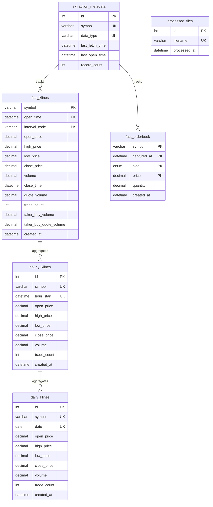
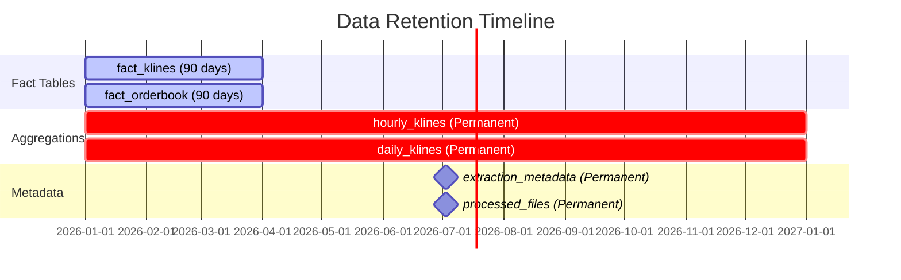

# Database Schema

Complete database schema documentation for the C

ryptoSimpleDataPipeline MySQL database.

## Table of Contents

1. [Overview](#overview)
2. [Database Entity Relationship](#database-entity-relationship)
3. [Fact Tables](#fact-tables)
4. [Aggregation Tables](#aggregation-tables)
5. [Metadata Tables](#metadata-tables)
6. [Indexes](#indexes)
7. [Data Retention](#data-retention)

---

## Overview

The database follows a **dimensional modeling** approach with fact tables for raw data and aggregation tables for efficient querying.

**Database Name**: `crypto_pipeline`

**Total Tables**: 6

| Table | Type | Purpose | Retention |
|-------|------|---------|-----------|
| `fact_klines` | Fact | Minute-level OHLCV data | 90 days |
| `fact_orderbook` | Fact | Order book snapshots | 90 days |
| `hourly_klines` | Aggregation | Hourly OHLCV summaries | Permanent |
| `daily_klines` | Aggregation | Daily OHLCV summaries | Permanent |
| `extraction_metadata` | Metadata | Extraction tracking | Permanent |
| `processed_files` | Metadata | File processing tracking | Permanent |

---

## Database Entity Relationship



---

## Fact Tables

### fact_klines

**Purpose**: Store minute-level candlestick (OHLCV) data

**Schema**:
```sql
CREATE TABLE fact_klines (
    symbol VARCHAR(20) NOT NULL COMMENT 'Trading pair symbol (e.g., BTCUSDT)',
    open_time DATETIME NOT NULL COMMENT 'Candle open time',
    interval_code VARCHAR(10) NOT NULL DEFAULT '1m' COMMENT 'Time interval',
    open_price DECIMAL(20, 8) COMMENT 'Opening price',
    high_price DECIMAL(20, 8) COMMENT 'Highest price in interval',
    low_price DECIMAL(20, 8) COMMENT 'Lowest price in interval',
    close_price DECIMAL(20, 8) COMMENT 'Closing price',
    volume DECIMAL(30, 8) COMMENT 'Trading volume (base asset)',
    close_time DATETIME COMMENT 'Candle close time',
    quote_volume DECIMAL(30, 8) COMMENT 'Trading volume (quote asset)',
    trade_count INT COMMENT 'Number of trades',
    taker_buy_volume DECIMAL(30, 8) COMMENT 'Taker buy volume',
    taker_buy_quote_volume DECIMAL(30, 8) COMMENT 'Taker buy quote volume',
    created_at DATETIME DEFAULT CURRENT_TIMESTAMP COMMENT 'Record creation time',
    
    PRIMARY KEY (symbol, open_time, interval_code),
    INDEX idx_symbol_time (symbol, open_time)
) COMMENT='Fact table for minute-level k-lines data';
```

**Sample Data**:
| symbol | open_time | open_price | high_price | low_price | close_price | volume |
|--------|-----------|------------|------------|-----------|-------------|--------|
| BTCUSDT | 2026-01-09 14:30:00 | 42500.00 | 42600.00 | 42450.00 | 42550.00 | 125.45 |
| ETHUSDT | 2026-01-09 14:30:00 | 2250.50 | 2255.00 | 2248.00 | 2252.00 | 450.20 |

**Estimated Size**: ~125,000 records per symbol per 90 days (~150 MB)

---

### fact_orderbook

**Purpose**: Store order book snapshots

**Schema**:
```sql
CREATE TABLE fact_orderbook (
    symbol VARCHAR(20) NOT NULL COMMENT 'Trading pair symbol',
    captured_at DATETIME NOT NULL COMMENT 'Snapshot timestamp',
    side ENUM('bid', 'ask') NOT NULL COMMENT 'Order side',
    price DECIMAL(20, 8) NOT NULL COMMENT 'Price level',
    quantity DECIMAL(30, 8) COMMENT 'Quantity at price level',
    created_at DATETIME DEFAULT CURRENT_TIMESTAMP COMMENT 'Record creation time',
    
    PRIMARY KEY (symbol, captured_at, side, price),
    INDEX idx_symbol_time (symbol, captured_at)
) COMMENT='Fact table for orderbook snapshots';
```

**Sample Data**:
| symbol | captured_at | side | price | quantity |
|--------|-------------|------|--------|----------|
| BTCUSDT | 2026-01-09 14:30:00 | bid | 42500.00 | 1.25 |
| BTCUSDT | 2026-01-09 14:30:00 | bid | 42499.50 | 2.50 |
| BTCUSDT | 2026-01-09 14:30:00 | ask | 42500.50 | 1.10 |
| BTCUSDT | 2026-01-09 14:30:00 | ask | 42501.00 | 3.20 |

**Estimated Size**: ~50,000 records per symbol per 90 days (~80 MB)

---

## Aggregation Tables

### hourly_klines

**Purpose**: Hourly OHLCV aggregations from minute data

**Schema**:
```sql
CREATE TABLE hourly_klines (
    id INT AUTO_INCREMENT PRIMARY KEY,
    symbol VARCHAR(20) NOT NULL COMMENT 'Trading pair symbol',
    hour_start DATETIME NOT NULL COMMENT 'Hour start time',
    open_price DECIMAL(20, 8) COMMENT 'Opening price (first minute)',
    high_price DECIMAL(20, 8) COMMENT 'Highest price in hour',
    low_price DECIMAL(20, 8) COMMENT 'Lowest price in hour',
    close_price DECIMAL(20, 8) COMMENT 'Closing price (last minute)',
    volume DECIMAL(30, 8) COMMENT 'Total volume in hour',
    trade_count INT COMMENT 'Total number of minute candles',
    created_at DATETIME DEFAULT CURRENT_TIMESTAMP COMMENT 'Record creation time',
    
    UNIQUE KEY unique_symbol_hour (symbol, hour_start),
    INDEX idx_hour (hour_start)
) COMMENT='Hourly aggregated k-lines data';
```

**Sample Data**:
| id | symbol | hour_start | open_price | high_price | low_price | close_price | volume | trade_count |
|----|--------|------------|------------|------------|-----------|-------------|--------|-------------|
| 1 | BTCUSDT | 2026-01-09 14:00:00 | 42500.00 | 42800.00 | 42400.00 | 42750.00 | 7500.00 | 60 |

**Estimated Size**: ~2,500 records per symbol per year (~5 MB)

---

### daily_klines

**Purpose**: Daily OHLCV aggregations from hourly data

**Schema**:
```sql
CREATE TABLE daily_klines (
    id INT AUTO_INCREMENT PRIMARY KEY,
    symbol VARCHAR(20) NOT NULL COMMENT 'Trading pair symbol',
    date DATE NOT NULL COMMENT 'Date',
    open_price DECIMAL(20, 8) COMMENT 'Opening price (first hour)',
    high_price DECIMAL(20, 8) COMMENT 'Highest price in day',
    low_price DECIMAL(20, 8) COMMENT 'Lowest price in day',
    close_price DECIMAL(20, 8) COMMENT 'Closing price (last hour)',
    volume DECIMAL(30, 8) COMMENT 'Total volume in day',
    trade_count INT COMMENT 'Total number of hour candles',
    created_at DATETIME DEFAULT CURRENT_TIMESTAMP COMMENT 'Record creation time',
    
    UNIQUE KEY unique_symbol_date (symbol, date),
    INDEX idx_date (date)
) COMMENT='Daily aggregated k-lines data';
```

**Sample Data**:
| id | symbol | date | open_price | high_price | low_price | close_price | volume | trade_count |
|----|--------|------|------------|------------|-----------|-------------|--------|-------------|
| 1 | BTCUSDT | 2026-01-09 | 42000.00 | 43500.00 | 41800.00 | 42750.00 | 180000.00 | 24 |

**Estimated Size**: ~100 records per symbol per year (~500 KB)

---

## Metadata Tables

### extraction_metadata

**Purpose**: Track extraction state for incremental fetching

**Schema**:
```sql
CREATE TABLE extraction_metadata (
    id INT AUTO_INCREMENT PRIMARY KEY,
    symbol VARCHAR(20) NOT NULL COMMENT 'Trading pair symbol',
    data_type VARCHAR(20) NOT NULL COMMENT 'Data type (klines/depth)',
    last_fetch_time DATETIME COMMENT 'Last fetch timestamp',
    last_open_time DATETIME COMMENT 'Latest data point timestamp',
    record_count INT DEFAULT 0 COMMENT 'Total records fetched',
    
    UNIQUE KEY unique_symbol_type (symbol, data_type)
) COMMENT='Metadata for incremental extraction tracking';
```

**Sample Data**:
| id | symbol | data_type | last_fetch_time | last_open_time | record_count |
|----|--------|-----------|-----------------|----------------|--------------|
| 1 | BTCUSDT | klines | 2026-01-09 14:30:00 | 2026-01-09 14:29:00 | 125000 |
| 2 | BTCUSDT | depth | 2026-01-09 14:30:00 | 2026-01-09 14:30:00 | 50000 |

**Usage**: The `last_open_time` field is used by ExtractionManager to determine the starting point for incremental extraction.

---

### processed_files

**Purpose**: Track processed JSON files to prevent reprocessing

**Schema**:
```sql
CREATE TABLE processed_files (
    id INT AUTO_INCREMENT PRIMARY KEY,
    filename VARCHAR(500) NOT NULL UNIQUE COMMENT 'Full file path',
    processed_at DATETIME DEFAULT CURRENT_TIMESTAMP COMMENT 'Processing timestamp'
) COMMENT='Tracking table for processed data lake files';
```

**Sample Data**:
| id | filename | processed_at |
|----|----------|--------------|
| 1 | /data_lake/raw/2026-01-09/BTCUSDT_klines_1736428800123.json | 2026-01-09 14:31:00 |

**Usage**: TransformManager checks this table before processing files to avoid duplicate processing.

---

## Indexes

### Primary Indexes (Enforced Uniqueness)

1. **fact_klines**: `(symbol, open_time, interval_code)`
   - Ensures no duplicate minute candles for same symbol and time

2. **fact_orderbook**: `(symbol, captured_at, side, price)`
   - Ensures no duplicate price levels in same snapshot

3. **hourly_klines**: `(symbol, hour_start)` (UNIQUE KEY)
   - Ensures one aggregation per symbol per hour

4. **daily_klines**: `(symbol, date)` (UNIQUE KEY)
   - Ensures one aggregation per symbol per day

5. **extraction_metadata**: `(symbol, data_type)` (UNIQUE KEY)
   - Ensures one metadata entry per symbol and data type

6. **processed_files**: `filename` (UNIQUE)
   - Ensures each file is tracked only once

### Secondary Indexes (Query Performance)

1. **fact_klines**: `idx_symbol_time (symbol, open_time)`
   - Optimizes time-range queries for specific symbols

2. **fact_orderbook**: `idx_symbol_time (symbol, captured_at)`
   - Optimizes time-range queries for orderbook data

3. **hourly_klines**: `idx_hour (hour_start)`
   - Optimizes date-range queries

4. **daily_klines**: `idx_date (date)`
   - Optimizes date-range queries

---

## Data Retention

### Retention Policies



### Cleanup Jobs

**Frequency**: Weekly (maintenance_job)

**Cleanup Logic**:
```sql
-- Delete fact_klines older than 90 days
DELETE FROM fact_klines 
WHERE created_at < DATE_SUB(NOW(), INTERVAL 90 DAY);

-- Delete fact_orderbook older than 90 days
DELETE FROM fact_orderbook 
WHERE created_at < DATE_SUB(NOW(), INTERVAL 90 DAY);
```

**Note**: Aggregation and metadata tables are **never** automatically cleaned up.

---

## Database Initialization

**Script**: `rebuild_database.py`

**Creates**:
1. Database `crypto_pipeline` (drops if exists)
2. All 6 tables with proper schemas
3. All indexes

**Usage**:
```bash
python rebuild_database.py
```

---

## Performance Considerations

### Query Optimization

1. **Use Aggregation Tables**: For hourly/daily queries, use `hourly_klines` or `daily_klines` instead of fact tables
2. **Limit Result Sets**: Always use `LIMIT` clause for large tables
3. **Filter by Symbol**: Always include `symbol` in WHERE clause to leverage indexes
4. **Use Covering Indexes**: Indexes include all queried columns

### Recommended Queries

**Good - Uses index**:
```sql
SELECT * FROM fact_klines 
WHERE symbol = 'BTCUSDT' 
  AND open_time >= '2026-01-09 00:00:00' 
LIMIT 1000;
```

**Bad - Full table scan**:
```sql
SELECT * FROM fact_klines 
WHERE open_price > 42000;
```

---

## Backup & Recovery

### Backup Strategy

1. **Full Backup**: Daily at 3:00 AM
2. **Incremental Backup**: Every 6 hours
3. **Transaction Logs**: Continuous

### Backup Command

```bash
mysqldump -u root -p crypto_pipeline > backup_$(date +%Y%m%d).sql
```

### Restore Command

```bash
mysql -u root -p crypto_pipeline < backup_20260109.sql
```

---

## Related Documentation

- [System Architecture](ARCHITECTURE.md) - Overall system design
- [Data Pipeline](DATA_PIPELINE.md) - Data flow and ETL processes
- [Backend Architecture](BACKEND.md) - Backend module details
- [Deployment Guide](DEPLOYMENT.md) - Production setup
