# Data Pipeline Flow

This document provides a comprehensive overview of the data pipeline, detailing how data flows from the Binance API through extraction, storage, transformation, aggregation, and finally to visualization in the web application.

## Table of Contents

1. [Pipeline Overview](#pipeline-overview)
2. [Stage 1: Data Source (Binance API)](#stage-1-data-source-binance-api)
3. [Stage 2: Extract (ExtractionManager)](#stage-2-extract-extractionmanager)
4. [Stage 3: Data Lake (File Storage)](#stage-3-data-lake-file-storage)
5. [Stage 4: Transform (TransformManager)](#stage-4-transform-transformmanager)
6. [Stage 5: Data Warehouse (MySQL)](#stage-5-data-warehouse-mysql)
7. [Stage 6: Visualize (API Services)](#stage-6-visualize-api-services)
8. [Stage 7: App (React Frontend)](#stage-7-app-react-frontend)
9. [Maintenance & Lifecycle](#maintenance--lifecycle)

---

## Pipeline Overview

The data pipeline follows a classic **Extract-Transform-Load (ETL)** pattern with intelligent enhancements:

```mermaid
flowchart LR
    Source["🌐 Data Source<br/>Binance API"] 
    Extract["📥 Extract<br/>ExtractionManager<br/>(Incremental)"]
    Lake["💾 Data Lake<br/>JSON Files<br/>(Date-based)"]
    Transform["⚙️ Transform<br/>TransformManager<br/>(Deduplicate)"]
    Warehouse["🏢 Data Warehouse<br/>MySQL<br/>(Fact + Agg)"]
    Visualize["📊 Visualize<br/>Services<br/>(Process)"]
    App["🖥️ App<br/>React Frontend<br/>(Display)"]
    
    Source -->|"REST API<br/>K-lines + Depth"| Extract
    Extract -->|"Save JSON<br/>+ Metadata"| Lake
    Lake -->|"Read Files"| Transform
    Transform -->|"Load + Dedupe"| Warehouse
    Warehouse -->|"Query Data"| Visualize
    Visualize -->|"HTTP/JSON"| App
    
    style Source fill:#e3f2fd
    style Extract fill:#fff3e0
    style Lake fill:#f3e5f5
    style Transform fill:#e8f5e9
    style Warehouse fill:#fce4ec
    style Visualize fill:#e0f2f1
    style App fill:#f1f8e9
```



**Key Features**:
- ✅ **Incremental Extraction**: Only fetch new data since last run
- ✅ **Automatic Deduplication**: Prevent duplicate records in database
- ✅ **Gap Detection & Filling**: Automatically detect and fill missing data
- ✅ **Intelligent Archiving**: Auto-archive old files with configurable retention
- ✅ **Multi-level Aggregation**: Minute → Hourly → Daily summaries

---

## Stage 1: Data Source (Binance API)

### Overview

Binance provides public REST APIs for cryptocurrency market data without requiring authentication.

### Endpoints Used

#### 1. K-lines Endpoint (Candlestick Data)

**URL**: `https://api.binance.com/api/v3/klines`

**Purpose**: Fetch OHLCV (Open, High, Low, Close, Volume) candlestick data

**Parameters**:
- `symbol`: Trading pair (e.g., `BTCUSDT`)
- `interval`: Time interval (e.g., `1m`, `1h`, `1d`)
- `limit`: Number of klines to return (max 1000)
- `startTime`: Start time in milliseconds (optional, for incremental fetch)
- `endTime`: End time in milliseconds (optional)

**Response Format**:
```json
[
  [
    1499040000000,      // 0: Open time (timestamp)
    "0.01634000",       // 1: Open price
    "0.80000000",       // 2: High price
    "0.01575800",       // 3: Low price
    "0.01577100",       // 4: Close price
    "148976.11427815",  // 5: Volume
    1499644799999,      // 6: Close time
    "2434.19055334",    // 7: Quote asset volume
    308,                // 8: Number of trades
    "1756.87402397",    // 9: Taker buy base asset volume
    "28.46694368",      // 10: Taker buy quote asset volume
    "0"                 // 11: Ignore
  ]
]
```

#### 2. Orderbook Endpoint (Market Depth)

**URL**: `https://api.binance.com/api/v3/depth`

**Purpose**: Fetch current order book with bid/ask prices and quantities

**Parameters**:
- `symbol`: Trading pair (e.g., `BTCUSDT`)
- `limit`: Number of price levels (5, 10, 20, 50, 100, 500, 1000, 5000)

**Response Format**:
```json
{
  "lastUpdateId": 1027024,
  "bids": [
    ["4.00000000", "431.00000000"],  // [price, quantity]
    ["3.99000000", "123.00000000"]
  ],
  "asks": [
    ["4.00000200", "12.00000000"],
    ["4.01000000", "34.00000000"]
  ]
}
```

### Rate Limits

- **Request Weight Limit**: 1200 per minute
- **Order Limit**: 10 orders per second
- **Our Usage**: ~2-6 requests per minute (well within limits)

---

## Stage 2: Extract (ExtractionManager)

### Overview

The `ExtractionManager` is responsible for fetching data from Binance API and saving it to the data lake. It implements **intelligent incremental extraction** to minimize API calls and data redundancy.

### Incremental Extraction Strategy


### Key Logic

#### 1. Metadata Tracking

The `extraction_metadata` table tracks:
- `symbol`: Trading pair
- `data_type`: "klines" or "depth"
- `last_fetch_time`: When we last fetched data
- `last_open_time`: The latest data point's timestamp
- `record_count`: Total records fetched

#### 2. Gap Calculation

```python
if last_time:
    start_time = last_time + timedelta(minutes=1)
    now = datetime.now()
    minutes_gap = int((now - start_time).total_seconds() / 60)
    limit = min(minutes_gap + 10, 1000)  # +10 buffer, max 1000
else:
    limit = 100  # First fetch
```

#### 3. File Naming Convention

```
{symbol}_{data_type}_{timestamp_ms}.json
```

Examples:
- `BTCUSDT_klines_1736428800123.json`
- `ETHUSDT_depth_1736428800456.json`

### Process Flow

1. **Scheduler triggers** `run_cycle()` every N seconds (configurable)
2. **For each symbol**:
   - Query last extraction time from database
   - Calculate time gap since last fetch
   - Fetch only new k-lines data (if any)
   - Save to data lake as JSON file
   - Update extraction metadata
   - Fetch current orderbook snapshot
   - Save orderbook to data lake
   - Update extraction metadata

### Error Handling

- **API Timeout**: Retry with exponential backoff (not implemented, uses timeout)
- **API Failure**: Log error and continue with next symbol
- **File Write Failure**: Log error and continue

---

## Stage 3: Data Lake (MinIO Storage)

### Overview

The data lake is **MinIO-based object storage** that holds raw JSON data before transformation. MinIO provides S3-compatible storage with the following benefits:
- **Scalability**: Handles large volumes of data efficiently
- **Durability**: Data replication and high availability
- **S3-Compatible API**: Industry-standard interface
- **Performance**: High-throughput reads and writes
- **Cost-Effective**: Self-hosted alternative to cloud storage

**Purpose**:
- **Immutable raw data** for audit and reprocessing
- **Time-series organization** for easy access by date
- **Automatic archiving** to manage storage costs
- **Decoupled storage** from compute layer

### MinIO Bucket Structure

```
MinIO Server (localhost:9000)
├── crypto-raw/                  # Active data bucket (0-7 days)
│   ├── 2026-01-09/
│   │   ├── BTCUSDT_klines_1736428800123.json
│   │   ├── BTCUSDT_depth_1736428800456.json
│   │   ├── ETHUSDT_klines_1736428800789.json
│   │   └── ...
│   ├── 2026-01-10/
│   │   └── ...
│   └── 2026-01-13/
│       └── ...
└── crypto-archive/              # Archived data bucket (7-30 days)
    ├── 2026-01-01/
    │   └── ...
    └── 2026-01-05/
        └── ...

Legacy (DEPRECATED):
data_lake/                       # Local file storage (deprecated)
├── raw/
└── archive/
```

**Object Naming Convention**:
```
{date}/{symbol}_{data_type}_{timestamp_ms}.json
```

Examples:
- `2026-01-09/BTCUSDT_klines_1736428800123.json`
- `2026-01-09/ETHUSDT_depth_1736428800456.json`

### MinIO Configuration

**docker-compose.yml**:
```yaml
services:
  minio:
    image: minio/minio:latest
    container_name: crypto_pipeline_minio
    ports:
      - "9000:9000"  # MinIO API
      - "9001:9001"  # MinIO Console UI
    environment:
      MINIO_ROOT_USER: minioadmin
      MINIO_ROOT_PASSWORD: minioadmin123
    volumes:
      - ./minio_data:/data
    command: server /data --console-address ":9001"
    restart: unless-stopped
```

**Application Configuration**  (`src/config.py`):
```python
MINIO_ENDPOINT = 'localhost:9000'
MINIO_ACCESS_KEY = 'minioadmin'
MINIO_SECRET_KEY = 'minioadmin123'
MINIO_BUCKET_RAW = 'crypto-raw'
MINIO_BUCKET_ARCHIVE = 'crypto-archive'
MINIO_SECURE = False  # Set to True for HTTPS in production
```

**Access MinIO Console**: http://localhost:9001
- Username: `minioadmin`
- Password: `minioadmin123`

### JSON File Format

The JSON format remains the same regardless of storage backend.

#### K-lines File
```json
{
  "symbol": "BTCUSDT",
  "captured_at": "2026-01-09T14:30:00.123456",
  "type": "klines",
  "interval": "1m",
  "data": [
    [
      1736428800000,    // Open time
      "42500.00",       // Open
      "42600.00",       // High
      "42450.00",       // Low
      "42550.00",       // Close
      "125.45",         // Volume
      1736428859999,    // Close time
      "5340250.00",     // Quote volume
      1250,             // Number of trades
      "62.50",          // Taker buy volume
      "2660125.00",     // Taker buy quote volume
      "0"               // Ignore
    ]
  ]
}
```

#### Orderbook File
```json
{
  "symbol": "BTCUSDT",
  "captured_at": "2026-01-09T14:30:00.123456",
  "type": "depth",
  "data": {
    "lastUpdateId": 1027024,
    "bids": [
      ["42500.00", "1.25"],
      ["42499.50", "2.50"]
    ],
    "asks": [
      ["42500.50", "1.10"],
      ["42501.00", "3.20"]
    ]
  }
}
```

### Storage Operations

#### Upload to MinIO

**ExtractionManager** uses `MinioClient` to upload data:

```python
# Save data directly to MinIO
object_name = f"{today}/{symbol}_{data_type}_{timestamp}.json"
json_data = json.dumps(payload)

if not self.minio_client.upload_data(
    json_data,
    object_name,
    bucket=self.minio_client.bucket_raw
):
    raise Exception(f"Failed to upload to MinIO: {object_name}")
```

**Key Features**:
- Direct upload without temporary files
- Automatic bucket creation
- Error handling with exceptions
- Returns object path for tracking

#### Read from MinIO

**TransformManager** reads files from MinIO:

```python
# List today's objects
objects = self.datalake_mgr.minio_client.list_objects(
    prefix=f"{today}/",
    bucket=self.datalake_mgr.minio_client.bucket_raw
)

# Get object content
for object_name in objects:
    content = self.datalake_mgr.minio_client.get_object_content(
        object_name,
        bucket=self.datalake_mgr.minio_client.bucket_raw
    )
    data = json.loads(content)
    # Process data...
```

### Archiving & Cleanup

#### Archiving (7 days)


**Process**:
1. Weekly maintenance job triggered
2. `DataLakeManager.archive_old_files(days=7)`
3. Query database for files older than 7 days
4. **Move objects** from `crypto-raw` to `crypto-archive` bucket using MinIO API
5. Update `processed_files` table with new location and `archived=TRUE`

**Code**:
```python
# Move object between buckets
if self.minio_client.move_object(
    object_name,
    object_name,  # Same name in archive
    src_bucket=self.minio_client.bucket_raw,
    dst_bucket=self.minio_client.bucket_archive
):
    # Update database
    cursor.execute("""
        UPDATE processed_files 
        SET archived = TRUE, file_path = %s 
        WHERE file_path = %s
    """, (new_path, file_path))
```

#### Cleanup (30 days)

```mermaid
flowchart LR
    Archive["crypto-archive bucket<br/>2025-12-01/"] -->|"30 days old"| Delete["🗑️ Deleted"]
```


**Process**:
1. Weekly maintenance job triggered
2. `DataLakeManager.cleanup_old_archives(days=30)`
3. Query database for archived files older than 30 days
4. **Delete objects** from `crypto-archive` bucket using MinIO API
5. Delete records from `processed_files` table
6. Permanent deletion (no recovery)

**Code**:
```python
# Delete from archive bucket
if self.minio_client.delete_object(
    object_name,
    bucket=self.minio_client.bucket_archive
):
    # Remove from database
    cursor.execute(
        "DELETE FROM processed_files WHERE file_path = %s",
        (file_path,)
    )
```

### MinIO vs Local Files

| Feature | MinIO (Current) | Local Files (Deprecated) |
|---------|----------------|---------------------------|
| **Scalability** | Excellent - handles TB of data | Limited by disk space |
| **Durability** | High - erasure coding support | Single point of failure |
| **Access Method** | S3 API over network | File system operations |
| **Backup** | Built-in replication | Manual file copying |
| **Cloud-Ready** | Yes - S3 compatible | Requires custom migration |
| **Console UI** | Yes - web browser at :9001 | No - command line only |
| **Multi-Server** | Yes - distributed mode | No - single machine |

**Migration**: The `migrate_to_minio.py` script can migrate existing local files to MinIO.

---

## Stage 4: Transform (TransformManager)

### Overview

The `TransformManager` reads JSON files from the data lake and loads data into the MySQL warehouse with automatic deduplication and gap filling.

### Transform Flow


### Deduplication Strategy

All fact tables use **composite primary keys** to prevent duplicates:

#### K-lines Table
```sql
PRIMARY KEY (symbol, open_time, interval_code)
```

#### Orderbook Table
```sql
PRIMARY KEY (symbol, captured_at, side, price)
```

**Insert Query with Deduplication**:
```sql
INSERT INTO fact_klines 
(symbol, open_time, interval_code, open_price, high_price, ...)
VALUES (%s, %s, %s, %s, %s, ...)
ON DUPLICATE KEY UPDATE
    open_price = VALUES(open_price),
    high_price = VALUES(high_price),
    ...
```

**Benefits**:
- Idempotent: Same file can be processed multiple times safely
- No manual duplicate checking needed
- Automatic update if data changes

### Gap Detection & Filling

#### Detection Logic

```sql
SELECT 
    symbol,
    open_time,
    LEAD(open_time) OVER (PARTITION BY symbol ORDER BY open_time) as next_time,
    TIMESTAMPDIFF(MINUTE, open_time, 
        LEAD(open_time) OVER (PARTITION BY symbol ORDER BY open_time)
    ) as gap_minutes
FROM fact_klines
WHERE interval_code = '1m'
HAVING gap_minutes > 1
```

#### Filling Process

1. Detect gaps > 1 minute
2. For each gap:
   - Calculate exact time range
   - Fetch missing data from Binance API
   - Insert into database with deduplication
3. Update extraction metadata

### Processed File Tracking

The `processed_files` table prevents reprocessing:

```sql
CREATE TABLE processed_files (
    id INT AUTO_INCREMENT PRIMARY KEY,
    filename VARCHAR(500) NOT NULL UNIQUE,
    processed_at DATETIME DEFAULT CURRENT_TIMESTAMP
);
```

---

## Stage 5: Data Warehouse (MySQL)

### Overview

The MySQL warehouse stores structured data in fact and aggregation tables optimized for querying and analytics.

### Table Categories

#### 1. Fact Tables (Raw Data)

**fact_klines**: Minute-level OHLCV data
```sql
CREATE TABLE fact_klines (
    symbol VARCHAR(20) NOT NULL,
    open_time DATETIME NOT NULL,
    interval_code VARCHAR(10) NOT NULL DEFAULT '1m',
    open_price DECIMAL(20, 8),
    high_price DECIMAL(20, 8),
    low_price DECIMAL(20, 8),
    close_price DECIMAL(20, 8),
    volume DECIMAL(30, 8),
    close_time DATETIME,
    quote_volume DECIMAL(30, 8),
    trade_count INT,
    taker_buy_volume DECIMAL(30, 8),
    taker_buy_quote_volume DECIMAL(30, 8),
    created_at DATETIME DEFAULT CURRENT_TIMESTAMP,
    PRIMARY KEY (symbol, open_time, interval_code),
    INDEX idx_symbol_time (symbol, open_time)
);
```

**fact_orderbook**: Order book snapshots
```sql
CREATE TABLE fact_orderbook (
    symbol VARCHAR(20) NOT NULL,
    captured_at DATETIME NOT NULL,
    side ENUM('bid', 'ask') NOT NULL,
    price DECIMAL(20, 8) NOT NULL,
    quantity DECIMAL(30, 8),
    created_at DATETIME DEFAULT CURRENT_TIMESTAMP,
    PRIMARY KEY (symbol, captured_at, side, price),
    INDEX idx_symbol_time (symbol, captured_at)
);
```

#### 2. Aggregation Tables

**hourly_klines**: Hourly OHLCV summaries
```sql
CREATE TABLE hourly_klines (
    id INT AUTO_INCREMENT PRIMARY KEY,
    symbol VARCHAR(20) NOT NULL,
    hour_start DATETIME NOT NULL,
    open_price DECIMAL(20, 8),
    high_price DECIMAL(20, 8),
    low_price DECIMAL(20, 8),
    close_price DECIMAL(20, 8),
    volume DECIMAL(30, 8),
    trade_count INT,
    created_at DATETIME DEFAULT CURRENT_TIMESTAMP,
    UNIQUE KEY unique_symbol_hour (symbol, hour_start),
    INDEX idx_hour (hour_start)
);
```

**daily_klines**: Daily OHLCV summaries
```sql
CREATE TABLE daily_klines (
    id INT AUTO_INCREMENT PRIMARY KEY,
    symbol VARCHAR(20) NOT NULL,
    date DATE NOT NULL,
    open_price DECIMAL(20, 8),
    high_price DECIMAL(20, 8),
    low_price DECIMAL(20, 8),
    close_price DECIMAL(20, 8),
    volume DECIMAL(30, 8),
    trade_count INT,
    created_at DATETIME DEFAULT CURRENT_TIMESTAMP,
    UNIQUE KEY unique_symbol_date (symbol, date),
    INDEX idx_date (date)
);
```

#### 3. Metadata Tables

**extraction_metadata**: Track extraction state
```sql
CREATE TABLE extraction_metadata (
    id INT AUTO_INCREMENT PRIMARY KEY,
    symbol VARCHAR(20) NOT NULL,
    data_type VARCHAR(20) NOT NULL,
    last_fetch_time DATETIME,
    last_open_time DATETIME,
    record_count INT DEFAULT 0,
    UNIQUE KEY unique_symbol_type (symbol, data_type)
);
```

**processed_files**: Track processed files
```sql
CREATE TABLE processed_files (
    id INT AUTO_INCREMENT PRIMARY KEY,
    filename VARCHAR(500) NOT NULL UNIQUE,
    processed_at DATETIME DEFAULT CURRENT_TIMESTAMP
);
```

### Aggregation Logic

#### Hourly Aggregation

```sql
INSERT INTO hourly_klines 
(symbol, hour_start, open_price, high_price, low_price, close_price, volume, trade_count)
SELECT 
    symbol,
    DATE_FORMAT(open_time, '%Y-%m-%d %H:00:00') as hour_start,
    SUBSTRING_INDEX(GROUP_CONCAT(open_price ORDER BY open_time ASC), ',', 1) as open_price,
    MAX(high_price) as high_price,
    MIN(low_price) as low_price,
    SUBSTRING_INDEX(GROUP_CONCAT(close_price ORDER BY open_time DESC), ',', 1) as close_price,
    SUM(volume) as volume,
    COUNT(*) as trade_count
FROM fact_klines
WHERE symbol = ? AND interval_code = '1m'
GROUP BY symbol, hour_start
ON DUPLICATE KEY UPDATE ...
```

**Logic**:
- **Open**: First price in the hour (earliest timestamp)
- **High**: Maximum price in the hour
- **Low**: Minimum price in the hour
- **Close**: Last price in the hour (latest timestamp)
- **Volume**: Sum of all volumes
- **Trade Count**: Count of minute candles

#### Daily Aggregation

Similar logic, but aggregates from `hourly_klines` instead of `fact_klines`.

### Data Retention

| Table | Retention | Cleanup Frequency |
|-------|-----------|-------------------|
| `fact_klines` | 90 days | Weekly |
| `fact_orderbook` | 90 days | Weekly |
| `hourly_klines` | Permanent | None |
| `daily_klines` | Permanent | None |
| `extraction_metadata` | Permanent | None |
| `processed_files` | Permanent | Manual cleanup only |

---

## Stage 6: Visualize (API Services)

### Overview

The visualization layer queries the warehouse and prepares data for the frontend. It consists of multiple service classes.

### Service Architecture


### Key Services

#### 1. VisualizeService

**Purpose**: Primary service for chart data and statistics

**Key Methods**:
- `get_kline_data(symbol, limit=500)` - Get candlestick data for charts
- `get_statistics(symbol)` - Calculate 24h price change, volume, high/low
- `get_indicators(symbol, period=100)` - Calculate RSI, MACD, Bollinger Bands
- `get_pipeline_status()` - Get extraction metadata and health
- `get_dashboard_metrics()` - Get comprehensive dashboard data

**Example - 24h Statistics**:
```python
def get_statistics(self, symbol):
    # Get last 24 hours of data
    df = self.get_kline_data(symbol, limit=1440)  # 24h * 60min
    
    if df.empty:
        return None
    
    latest = df.iloc[-1]
    oldest = df.iloc[0]
    
    price_change = latest['close_price'] - oldest['open_price']
    price_change_pct = (price_change / oldest['open_price']) * 100
    
    return {
        'current_price': latest['close_price'],
        'price_change_24h': price_change,
        'price_change_pct_24h': price_change_pct,
        'high_24h': df['high_price'].max(),
        'low_24h': df['low_price'].min(),
        'volume_24h': df['volume'].sum()
    }
```

#### 2. AnalyticsService

**Purpose**: Advanced analytics for React frontend

**Key Methods**:
- `get_candlestick_data(symbol, limit=200, interval='1m')` - OHLCV for Lightweight Charts
- `get_orderbook_snapshot(symbol, limit=20)` - Latest bids/asks

#### 3. StatsCalculator

**Purpose**: Calculate technical indicators

**Indicators**:
- **RSI (Relative Strength Index)**: 14-period momentum
- **MACD**: 12/26/9 period trend indicator
- **Bollinger Bands**: 20-period volatility bands (mean ± 2σ)

**Example - RSI Calculation**:
```python
@staticmethod
def calculate_rsi(prices, period=14):
    if len(prices) < period + 1:
        return None
    
    deltas = np.diff(prices)
    gains = np.where(deltas > 0, deltas, 0)
    losses = np.where(deltas < 0, -deltas, 0)
    
    avg_gain = np.mean(gains[:period])
    avg_loss = np.mean(losses[:period])
    
    rs = avg_gain / avg_loss if avg_loss != 0 else 0
    rsi = 100 - (100 / (1 + rs))
    
    return round(rsi, 2)
```

---

## Stage 7: App (React Frontend)

### Overview

The React frontend consumes the API and displays data through interactive charts, tables, and dashboards.

### Page Flow


### Key Features

#### 1. Dashboard
- Real-time 24h statistics cards for all symbols
- Price, change %, volume, high/low
- Auto-refresh every 15 seconds

#### 2. Analytics
- Professional candlestick charts (Lightweight Charts)
- Orderbook depth visualization (Recharts)
- Symbol selection dropdown
- Time range selection

#### 3. Pipeline
- Ingestion logs table with pagination
- Deduplication statistics
- Storage health metrics
- Data lake and warehouse stats

#### 4. Scheduler
- View all scheduled jobs
- Enable/disable jobs
- Adjust intervals
- Manual job triggers

#### 5. Settings
- Add/remove tracked symbols
- System configuration
- Metadata display

---

## Maintenance & Lifecycle

### Scheduled Jobs


### Maintenance Tasks

#### Weekly Maintenance Job

**Triggers**: Every Sunday at 2:00 AM (configurable)

**Tasks**:
1. **Archive Old Files** (DataLakeManager)
   - Move files older than 7 days to archive
   - Update file metadata

2. **Cleanup Old Archives** (DataLakeManager)
   - Delete archived files older than 30 days
   - Free up disk space

3. **Cleanup Old Database Records** (WarehouseAggregator)
   - Delete `fact_klines` older than 90 days
   - Delete `fact_orderbook` older than 90 days
   - Keep aggregation tables (hourly/daily) permanently

4. **Database Optimization** (Optional)
   - Analyze tables
   - Optimize indexes
   - Vacuum deleted records

### Data Lifecycle Timeline


**Summary**:
- **Files**: Active 7 days → Archived 30 days → Deleted
- **Fact Tables**: Active 90 days → Deleted
- **Aggregation Tables**: Permanent retention

---

## Related Documentation

- [System Architecture](ARCHITECTURE.md) - Overall system design
- [API Reference](API_REFERENCE.md) - Complete API documentation
- [Database Schema](DATABASE_SCHEMA.md) - Detailed schema documentation
- [Backend Architecture](BACKEND.md) - Backend module details
- [Frontend Architecture](FRONTEND.md) - Frontend component details
